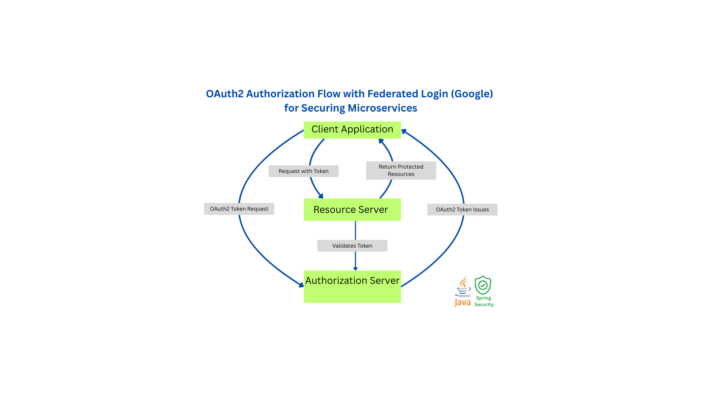

# OAuth2 Authorization Server 🛡️🔐

  
This project implements a secure OAuth2 Authorization Server using **HTTPS**, **Spring Boot 3.4**, **Spring Security 6.4**, and **Spring Authorization Server 1.4.2**.  
It supports RestClient, federated login, JWT tokens, token storage, and OIDC discovery — following modern Spring Security best practices

---

## 💡 Tech Stack

- **Java** – business logic and user management
- **Spring Boot 3.4**, **Spring Security 6.4**
- **Spring Authorization Server 1.4.2**
- **Security** – OAuth2, OIDC, JWT
- **PostgreSQL** – persistent token and user storage

---

## Project Showcase

- [🎥 UI walkthrough video](docs_photo/Oauth2SecureService_video.mp4) _(short demo, downloadable if not previewable)_
- 📂 Example validation images can be found in the `/docs_photo` folder

---

## Key Engineering Challenges

- JWT-based authentication with access tokens
- Federated login (Google) via Spring Authorization Server
- Token customization using claims mapper
- HTTPS-only flow with self-signed certificate
- Full support for OIDC discovery and token endpoints
- RestClient integration for secure inter-service communication
- Clean setup with Spring Security 6.4.4 — no deprecated APIs, everything works out of the box

---

## Endpoints Overview

| Port | Endpoint                                      | Description                     |
|------|-----------------------------------------------|---------------------------------|
| 9000 | `/oauth2/authorize`                           | OAuth2 authorization endpoint   |
| 9000 | `/oauth2/token`                               | Token issuing endpoint          |
| 9000 | `/.well-known/openid-configuration`           | OIDC discovery endpoint         |
| 8080 | `/public`                                     | Public data from resource server |
| 8080 | `/secure`                                     | Protected data (requires token) |
| 8080 | `/token`                                      | Shows current token metadata    |

---

## Access Services

- Client Application: `https://localhost:8080`
- Resource Server: `https://localhost:8081`
- Authorization Server: `https://localhost:9000`

---

## ⚠️ Technical Notes

- This microservice uses a **self-signed HTTPS certificate** to secure the full OAuth2 authorization flow (as required by Spring Security).
- In a production setup, I would use **Nginx** as a reverse proxy and obtain **Let's Encrypt or commercial certificates**, depending on business needs.

---

## 🤝 Thanks for Your Interest!

I'm always open to feedback, collaboration, or professional connections.  
Feel free to reach out!
